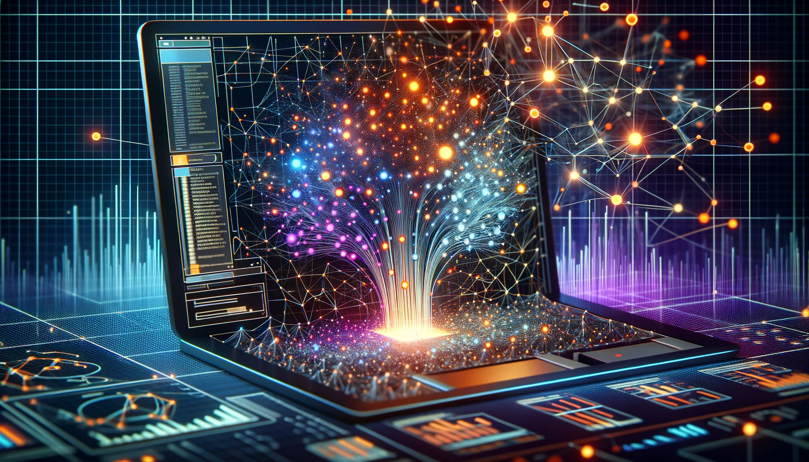
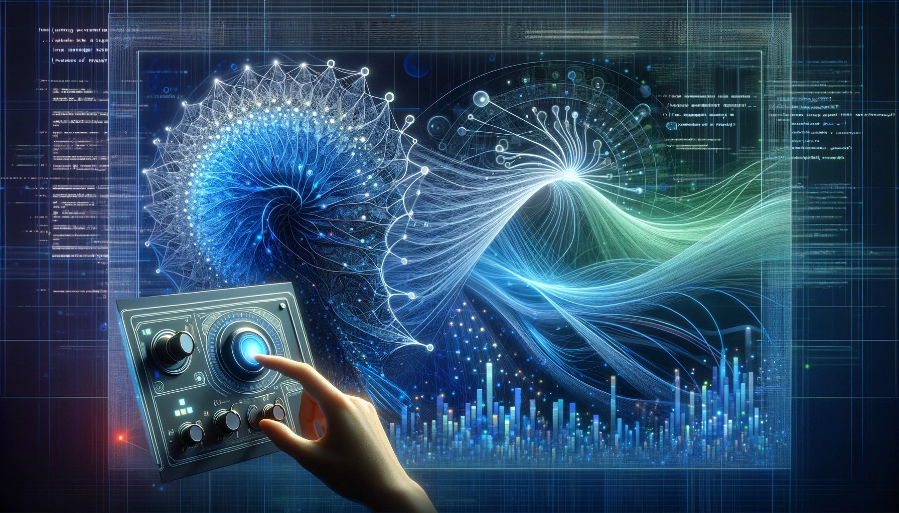
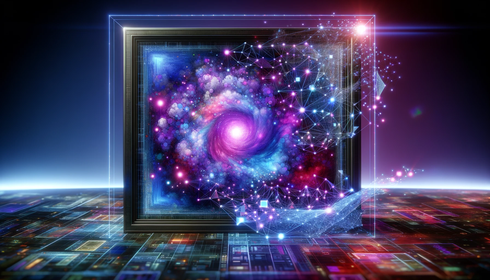
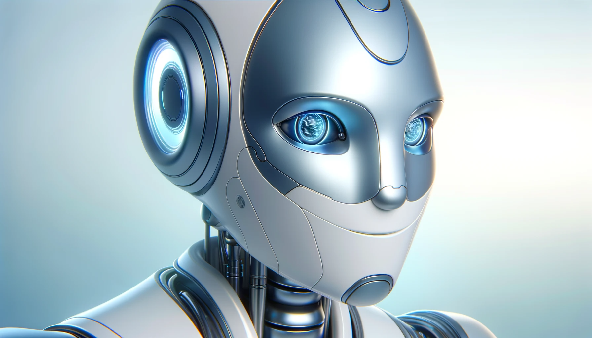

# 平台能力 Platform Capabilities
## Text Generation Models
Text generation models are now capable of JSON mode and Reproducible outputs. We also launched the Assistants API to enable you to build agent-like experiences on top of our text-generation models. GPT-4 Turbo is available in preview by specifying gpt-4-1106-preview as the model name.

OpenAI's text generation models (often called generative pre-trained transformers or large language models) have been trained to understand natural language, code, and images. The models provide text outputs in response to their inputs. The inputs to these models are also referred to as "prompts". Designing a prompt is essentially how you “program” a large language model model, usually by providing instructions or some examples of how to successfully complete a task.

Using OpenAI's text generation models, you can build applications to:

* Draft documents
* Write computer code
* Answer questions about a knowledge base
* Analyze texts
* Give software a natural language interface
* Tutor in a range of subjects
* Translate languages
* Simulate characters for games

With the release of gpt-4-vision-preview, you can now build systems that also process and understand images.

* Explore GPT-4 with image inputs
* GPT-4 Turbo

To use one of these models via the OpenAI API, you’ll send a request containing the inputs and your API key, and receive a response containing the model’s output. Our latest models, gpt-4 and gpt-3.5-turbo, are accessed through the chat completions API endpoint.

| | MODEL FAMILIES | API ENDPOINT |
| ----- | ----- | ----- |
| Newer models (2023–) | gpt-4 (and gpt-4 turbo), gpt-3.5-turbo | https://api.openai.com/v1/chat/completions |
| Updated base models (2023) | babbage-002, davinci-002 | https://api.openai.com/v1/completions |
| Legacy models (2020–2022) | text-davinci-003, text-davinci-002, davinci, curie, babbage, ada | https://api.openai.com/v1/completions |

You can experiment with various models in the chat playground. If you’re not sure which model to use, then use gpt-3.5-turbo or gpt-4.

### Chat Completions API

Chat models take a list of messages as input and return a model-generated message as output. Although the chat format is designed to make multi-turn conversations easy, it’s just as useful for single-turn tasks without any conversation.

An example Chat Completions API call looks like the following:

```python "
from openai import OpenAI
client = OpenAI()

response = client.chat.completions.create(
  model="gpt-3.5-turbo",
  messages=[
    {"role": "system", "content": "You are a helpful assistant."},
    {"role": "user", "content": "Who won the world series in 2020?"},
    {"role": "assistant", "content": "The Los Angeles Dodgers won the World Series in 2020."},
    {"role": "user", "content": "Where was it played?"}
  ]
)
```

To learn more, you can view the full API reference documentation for the Chat API.

The main input is the messages parameter. Messages must be an array of message objects, where each object has a role (either "system", "user", or "assistant") and content. Conversations can be as short as one message or many back and forth turns.

Typically, a conversation is formatted with a system message first, followed by alternating user and assistant messages.

The system message helps set the behavior of the assistant. For example, you can modify the personality of the assistant or provide specific instructions about how it should behave throughout the conversation. However note that the system message is optional and the model’s behavior without a system message is likely to be similar to using a generic message such as "You are a helpful assistant."

The user messages provide requests or comments for the assistant to respond to. Assistant messages store previous assistant responses, but can also be written by you to give examples of desired behavior.

Including conversation history is important when user instructions refer to prior messages. In the example above, the user’s final question of "Where was it played?" only makes sense in the context of the prior messages about the World Series of 2020. Because the models have no memory of past requests, all relevant information must be supplied as part of the conversation history in each request. If a conversation cannot fit within the model’s token limit, it will need to be shortened in some way.

* To mimic the effect seen in ChatGPT where the text is returned iteratively, set the stream parameter to true.

#### Chat Completions Response Format

* An example Chat Completions API response looks as follows:

```json "
{
  "choices": [
    {
      "finish_reason": "stop",
      "index": 0,
      "message": {
        "content": "The 2020 World Series was played in Texas at Globe Life Field in Arlington.",
        "role": "assistant"
      }
    }
  ],
  "created": 1677664795,
  "id": "chatcmpl-7QyqpwdfhqwajicIEznoc6Q47XAyW",
  "model": "gpt-3.5-turbo-0613",
  "object": "chat.completion",
  "usage": {
    "completion_tokens": 17,
    "prompt_tokens": 57,
    "total_tokens": 74
  }
}
```

The assistant’s reply can be extracted with:

```python "
response['choices'][0]['message']['content']
```

Every response will include a finish_reason. The possible values for finish_reason are:

* stop: API returned complete message, or a message terminated by one of the stop sequences provided via the stop parameter
* length: Incomplete model output due to max_tokens parameter or token limit
* function_call: The model decided to call a function
* content_filter: Omitted content due to a flag from our content filters
* null: API response still in progress or incomplete

Depending on input parameters, the model response may include different information.

### JSON mode

### Reproducible Outputs

### Managing Tokens

### FAQ

## Function Calling


## Embeddings


## Fine-Tuning


## Image Generation


## Vision Understanding


### Managing Images
The Chat Completions API, unlike the Assistants API, is not stateful. That means you have to manage the messages (including images) you pass to the model yourself. If you want to pass the same image to the model multiple times, you will have to pass the image each time you make a request to the API.

For long running conversations, we suggest passing images via URL's instead of base64. The latency of the model can also be improved by downsizing your images ahead of time to be less than the maximum size they are expected them to be. For low res mode, we expect a 512px x 512px image. For high rest mode, the short side of the image should be less than 768px and the long side should be less than 2,000px.

After an image has been processed by the model, it is deleted from OpenAI servers and not retained. We do not use data uploaded via the OpenAI API to train our models.

### Limitations
While GPT-4 with vision is powerful and can be used in many situations, it is important to understand the limitations of the model. Here are some of the limitations we are aware of:

* Medical images: The model is not suitable for interpreting specialized medical images like CT scans and shouldn't be used for medical advice.
* Non-English: The model may not perform optimally when handling images with text of non-Latin alphabets, such as Japanese or Korean.
* Big text: Enlarge text within the image to improve readability, but avoid cropping important details.
* Rotation: The model may misinterpret rotated / upside-down text or images.
* Visual elements: The model may struggle to understand graphs or text where colors or styles like solid, dashed, or dotted lines vary.
* Spatial reasoning: The model struggles with tasks requiring precise spatial localization, such as identifying chess positions.
* Accuracy: The model may generate incorrect descriptions or captions in certain scenarios.
* Image shape: The model struggles with panoramic and fisheye images.
* Metadata and resizing: The model doesn't process original file names or metadata, and images are resized before analysis, affecting their original dimensions.
* Counting: May give approximate counts for objects in images.
* CAPTCHAS: For safety reasons, we have implemented a system to block the submission of CAPTCHAs.

### Calculating Costs
* Image inputs are metered and charged in tokens, just as text inputs are. The token cost of a given image is determined by two factors: its size, and the detail option on each image_url block. All images with detail: low cost 85 tokens each. detail: high images are first scaled to fit within a 2048 x 2048 square, maintaining their aspect ratio. Then, they are scaled such that the shortest side of the image is 768px long. Finally, we count how many 512px squares the image consists of. Each of those squares costs 170 tokens. Another 85 tokens are always added to the final total.
* Here are some examples demonstrating the above.
* A 1024 x 1024 square image in detail: high mode costs 765 tokens
  * 1024 is less than 2048, so there is no initial resize.
  * The shortest side is 1024, so we scale the image down to 768 x 768.
  * 4 512px square tiles are needed to represent the image, so the final token cost is 170 * 4 + 85 = 765.
* A 2048 x 4096 image in detail: high mode costs 1105 tokens
  * We scale down the image to 1024 x 2048 to fit within the 2048 square.
  * The shortest side is 1024, so we further scale down to 768 x 1536.
  * 6 512px tiles are needed, so the final token cost is 170 * 6 + 85 = 1105.
* A 4096 x 8192 image in detail: low most costs 85 tokens
  * Regardless of input size, low detail images are a fixed cost.

## Text-to-Speech


## Speech-to-Text


## Moderation
