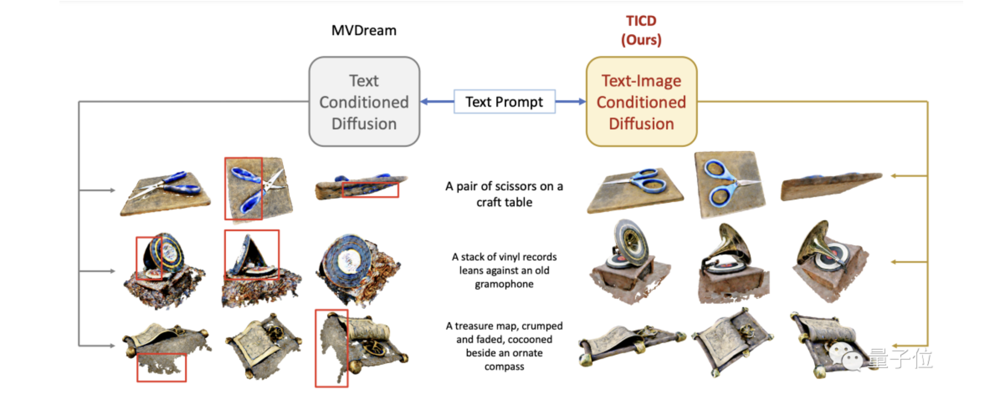

## Paper Title
* [Text-Image Conditioned Diffusion for Consistent Text-to-3D Generation](https://arxiv.org/abs/2312.11774)

#### 算法妈妈商业和技术结合点
* 文字生成3D模型是构筑3D世界的基石

#### Authors
* Yuze He et. al.

#### Abstract
* By lifting the pre-trained 2D diffusion models into Neural Radiance Fields (NeRFs), text-to-3D generation methods have made great progress. Many state-of-the-art approaches usually apply score distillation sampling (SDS) to optimize the NeRF representations, which supervises the NeRF optimization with pre-trained text-conditioned 2D diffusion models such as Imagen. However, the supervision signal provided by such pre-trained diffusion models only depends on text prompts and does not constrain the multi-view consistency. To inject the cross-view consistency into diffusion priors, some recent works finetune the 2D diffusion model with multi-view data, but still lack fine-grained view coherence. To tackle this challenge, we incorporate multi-view image conditions into the supervision signal of NeRF optimization, which explicitly enforces fine-grained view consistency. With such stronger supervision, our proposed text-to-3D method effectively mitigates the generation of floaters (due to excessive densities) and completely empty spaces (due to insufficient densities). Our quantitative evaluations on the T3Bench dataset demonstrate that our method achieves state-of-the-art performance over existing text-to-3D methods. We will make the code publicly available.