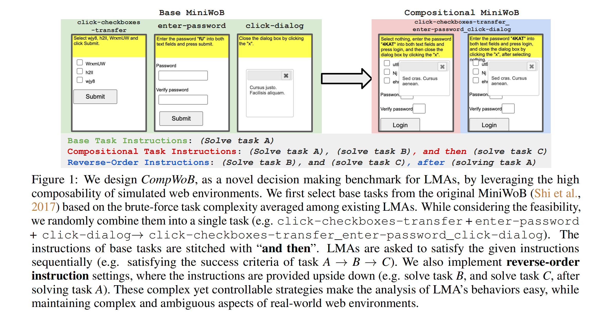

# 2023-12-02论文解读

## Paper Title
[LANGUAGE MODEL AGENTS SUFFER FROM COMPOSITIONAL GENERALIZATION IN WEB AUTOMATION](https://github.com/weijiang2023/algmon-kb/blob/main/kb/computer.science/TASKS.2311.18751v1.pdf)

#### Authors
Hiroki Furuta et. al.

#### Affiliations
Google Deepmind et. al.

#### Date
Nov 11, 2023

#### 5Ws
Language model agents (LMA) recently emerged as a promising paradigm on mutistep decision making tasks, often outperforming humans and other reinforcement learning agents. Despite the promise, their performance on real-world applications that often involve combinations of tasks is still underexplored. In this work, we introduce a new benchmark, called CompWoB – 50 new compositional web automation tasks reflecting more realistic assumptions. We show that while existing prompted LMAs (gpt-3.5-turbo or gpt-4) achieve 94.0% average success rate on base tasks, their performance degrades to 24.9% success rate on compositional tasks. On the other hand, transferred LMAs (finetuned only on base tasks) show less generalization gap, dropping from 85.4% to 54.8%. By balancing data distribution across tasks, we train a new model, HTML-T5++, that surpasses human-level performance (95.2%) on MiniWoB, and achieves the best zero-shot performance on CompWoB (61.5%). While these highlight the promise of small-scale finetuned and transferred models for compositional generalization, their performance further degrades under different instruction compositions changing combinational order. In contrast to the recent remarkable success of LMA, our benchmark and detailed analysis emphasize the necessity of building LMAs that are robust and generalizable to task compositionality for real-world deployment.

##### 1. What is the problem?
The problem addressed is the performance of LMAs in handling compositional web automation tasks. These tasks involve combinations of simpler tasks that LMAs previously excelled at in isolation. The study investigates how well LMAs can generalize to more complex, real-world-like task compositions that they haven't been explicitly trained on​​​​.

##### 2. Why is the problem important?
The problem is crucial because LMAs have shown promise in multi-step decision-making tasks, often surpassing human performance. However, their capability in real-world applications involving complex, combined tasks remains underexplored. Addressing this gap is vital for deploying LMAs in practical settings where tasks are rarely isolated and often involve multiple, interrelated components​​​​.

##### 3. Why is the problem difficult?
The difficulty arises from the inherent complexity and unpredictability of real-world tasks. LMAs have to deal with challenges like complex observations, domain generalization, and ambiguity of instructions, exacerbated by the open-ended nature of real-world tasks. Furthermore, compositional tasks in web automation can involve varied combinations of simpler tasks, increasing complexity and requiring robust generalization abilities from the LMAs​​.

##### 4. What are the old techniques?
The old techniques for LMAs in web automation included methods like Recursive Criticism and Improvement (RCI), AdaPlanner, and Synapse. These techniques utilized strategies like open-loop planning with prompt-based criticism, program synthesis to mitigate hallucination in planning, and structured prompting with state filtering and task reformulation​​.

##### 5. Advantages and disadvantages of the new techniques?
* Advantages: The new technique, represented by a model called HTML-T5++, demonstrates better generalization to compositional tasks and superior performance in zero-shot settings. It achieves this by rebalancing data distribution across tasks, addressing the limitations of older techniques that struggled with sub-optimal performance and insufficient data coverage​​.

* Disadvantages: However, even the new techniques face challenges. They exhibit performance degradation when dealing with different instruction compositions or reverse-order instructions, indicating a sensitivity to the order and complexity of tasks. This highlights a need for further improvement in LMAs to handle real-world task complexity and ambiguity​​.

##### 6. Conclusion
In summary, while the new techniques like HTML-T5++ show promise in compositional generalization, the study reveals significant gaps that need to be addressed for LMAs to be robust and effective in real-world, complex decision-making tasks​​.