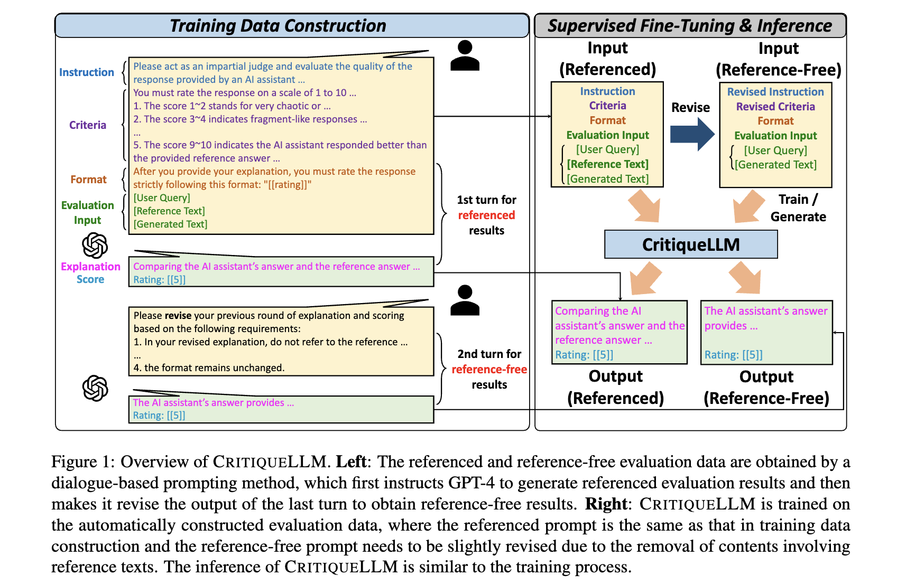

# 2023-12-03论文解读

## Paper Title
[CRITIQUE LLM: Scaling LLM-as-Critic for Effective and Explainable Evaluation of Large Language Model Generation](https://github.com/weijiang2023/algmon-kb/blob/main/kb/computer.science/CRITIQUE.2311.18702v1.pdf)

#### Authors
Pei Ke et. al.

#### Affiliations
Tsinghua University et. al.

#### Date
Nov 30, 2023

#### 5Ws
Since the natural language processing (NLP) community started to make large language models (LLMs), such as GPT-4, act as a critic to evaluate the quality of generated texts, most of them only train a critique generation model of a specific scale on specific datasets. We argue that a comprehensive investigation on the
key factor of LLM-based evaluation models, such as scaling properties, is lacking, so that it is still inconclusive whether these models have potential to replace GPT-4’s evaluation in practical scenarios. In this paper, we propose a new critique generation model called CRITIQUELLM, which includes a dialogue-based
prompting method for high-quality referenced / reference-free evaluation data. Experimental results show that our model can achieve comparable evaluation performance to GPT-4 especially in system-level correlations, and
even outperform GPT-4 in 3 out of 8 tasks in a challenging reference-free setting. We conduct detailed analysis to show promising scaling properties of our model in the quality of generated critiques. We also demonstrate that our generated critiques can act as scalable feedback to directly improve the generation quality of LLMs1.

##### 1. What is the problem?
The key issue addressed is the evaluation of text quality generated by large language models (LLMs) like GPT-4. Traditionally, LLMs have been evaluated using metrics based on n-gram overlap with reference texts, such as BLEU and ROUGE. However, these methods have limitations in terms of effectiveness, particularly in capturing the nuances of language quality​​. This has led to the development of LLM-based evaluation models, but most existing models are trained on specific datasets and scales, and their effectiveness compared to GPT-4's evaluation is still inconclusive​​.

##### 2. Why is the problem important?
Evaluating LLMs accurately is crucial as they rapidly approach human-level performance in various tasks. High-quality evaluation is necessary to provide scalable feedback for the continuous improvement of LLMs​​.

##### 3. Why is the problem difficult?
The challenge lies in the limitations of traditional evaluation metrics and the inconclusiveness of existing LLM-based evaluation models. These methods often fail to adequately capture text quality and can be costly, unstable, and risk data leakage when using commercial APIs​​.

##### 4. What are the old techniques?
Traditional techniques relied on n-gram overlap metrics (like BLEU, ROUGE) or model-based evaluations using state-of-the-art LLMs accessed via APIs. These methods either lacked effectiveness in capturing content quality or were limited due to their dependency on external APIs and specific datasets​​.

##### 5. Advantages and disadvantages of the new techniques?
The proposed model, CRITIQUELLM, includes a dialogue-based prompting method for generating high-quality referenced and reference-free evaluation data. It aims to provide effective, explainable evaluations and scalable feedback to improve LLMs. Experimental results show that CRITIQUELLM can perform comparably with, and in some cases outperform, GPT-4, particularly in system-level correlations. This model shows promising scaling properties and can act as feedback to directly improve the generation quality of LLMs. However, the paper doesn't explicitly mention any disadvantages, but like any model, potential limitations could include the need for extensive training data and computational resources, as well as possible biases inherent in the training data​​.

##### 6. Conclusion
We present a critique generation model called CRITIQUELLM, which is trained on high-quality reference or reference-free evaluation data obtained by our devised dialogue-based prompting method. Experimental results show that CRITIQUELLM can achieve comparable performance with GPT-4 especially in system-level correlations, and even beat GPT-4 in 3 out of 8 tasks in the reference-free setting. CRITIQUELLM also exhibits good scaling properties and provides scalable feedback which can help improve the generation quality of LLMs.