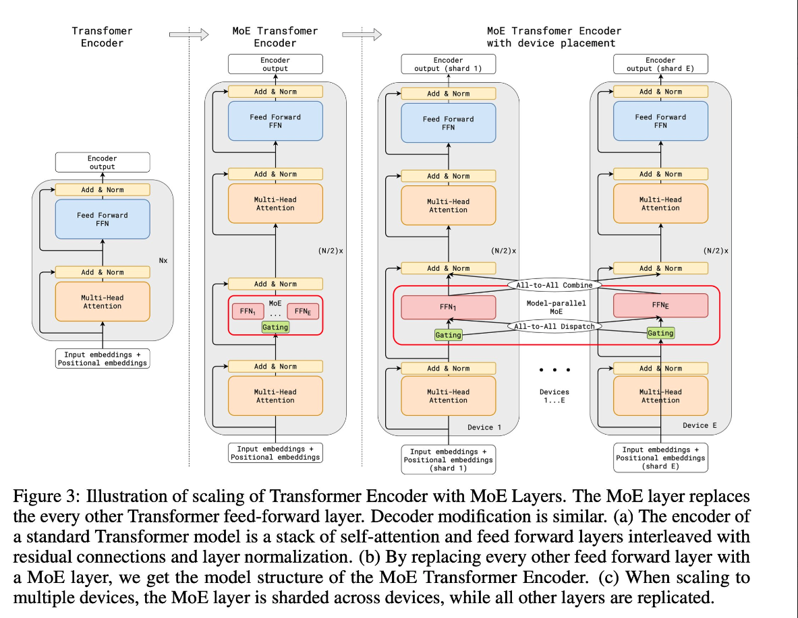
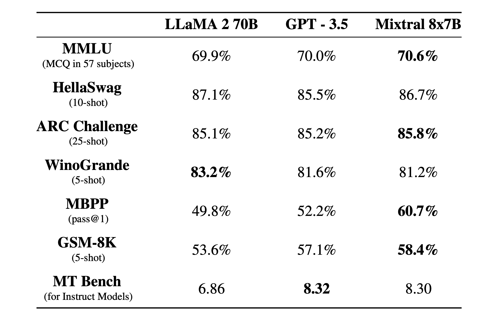
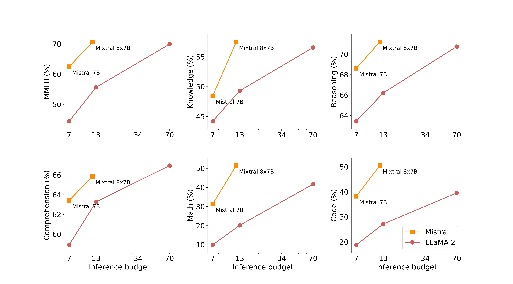
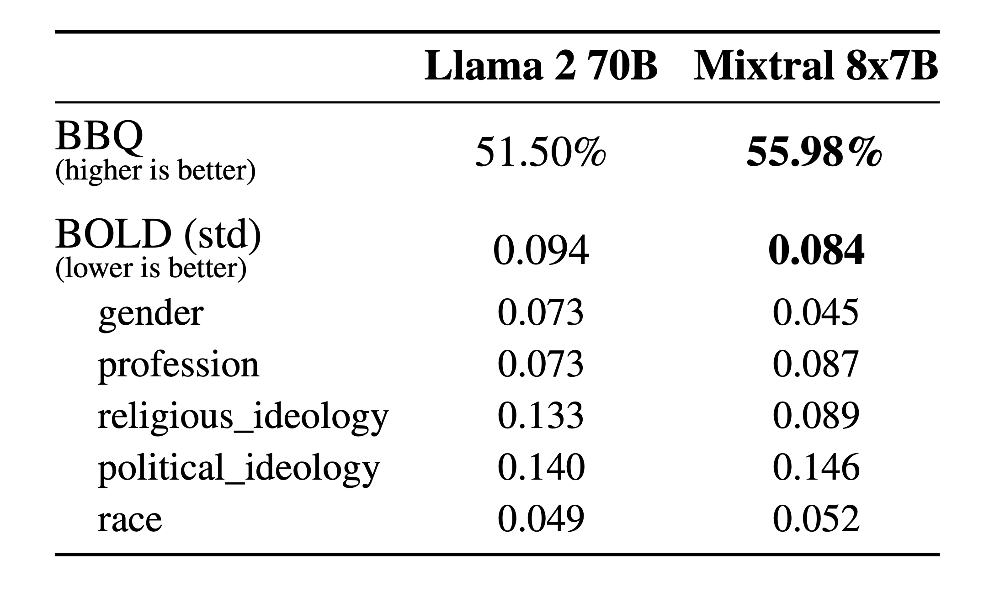

# MoE技术解读

## Intro
Mixtral 8x7B, a high-quality sparse mixture of experts model (SMoE) with open weights. Mixtral outperforms Llama 270B on most benchmarks with 6x faster inference. It is the strongest open-weight model with a permissive license and the best model overall regarding cost/performance trade-offs. In particular, it matches or outperforms GPT3.5 on most standard benchmarks.

Mixtral has the following capabilities.

* It gracefully handles a context of 32k tokens.
* It handles English, French, Italian, German and Spanish.
* It shows strong performance in code generation.
* It can be finetuned into an instruction-following model that achieves a score of 8.3 on MT-Bench.

## Pushing the frontier of open models with sparse architectures
Mixtral is a sparse mixture-of-experts network. It is a decoder-only model where the feedforward block picks from a set of 8 distinct groups of parameters. At every layer, for every token, a router network chooses two of these groups (the “experts”) to process the token and combine their output additively.

This technique increases the number of parameters of a model while controlling cost and latency, as the model only uses a fraction of the total set of parameters per token. Concretely, Mixtral has 46.7B total parameters but only uses 12.9B parameters per token. It, therefore, processes input and generates output at the same speed and for the same cost as a 12.9B model.

Mixtral is pre-trained on data extracted from the open Web – we train experts and routers simultaneously.

## Performance
We compare Mixtral to the Llama 2 family and the GPT3.5 base model. Mixtral matches or outperforms Llama 2 70B, as well as GPT3.5, on most benchmarks.

On the following figure, we measure the quality versus inference budget tradeoff. Mistral 7B and Mixtral 8x7B belong to a family of highly efficient models compared to Llama 2 models.

The following table give detailed results on the figure above.

## Hallucination and Biases

Compared to Llama 2, Mixtral presents less bias on the BBQ benchmark. Overall, Mixtral displays more positive sentiments than Llama 2 on BOLD, with similar variances within each dimension.

## Language
Mixtral 8x7B masters French, German, Spanish, Italian, and English.

## Instructed models
We release Mixtral 8x7B Instruct alongside Mixtral 8x7B. This model has been optimised through supervised fine-tuning and direct preference optimisation (DPO) for careful instruction following. On MT-Bench, it reaches a score of 8.30, making it the best open-source model, with a performance comparable to GPT3.5.

Note: Mixtral can be gracefully prompted to ban some outputs from constructing applications that require a strong level of moderation, as exemplified here. A proper preference tuning can also serve this purpose. Bear in mind that without such a prompt, the model will just follow whatever instructions are given.

## Deploy Mixtral with an open-source deployment stack
To enable the community to run Mixtral with a fully open-source stack, we have submitted changes to the vLLM project, which integrates Megablocks CUDA kernels for efficient inference.

Skypilot allows the deployment of vLLM endpoints on any instance in the cloud.

## Use Mixtral on our platform
We’re currently using Mixtral 8x7B behind our endpoint mistral-small, which is available in beta. Register to get early access to all generative and embedding endpoints.

## What is Mixture-of-Experts (MoE)?
MoE is a neural network architecture design that integrates layers of experts/models within the Transformer block. As data flows through the MoE layers, each input token is dynamically routed to a subset of the experts for computation. This approach allows for more efficient compute with better results as each expert becomes specialized at particular tasks.

## Key Components
- Experts: MoE layers comprise many experts, small MLPs or complex LLMs like Mistral 7B.
- Router: Routers determine which input tokens get assigned to which experts. There are two routing strategies: token chooses the router or router chooses the token. How does it work exactly? It uses a softmax gating function to model a probability distribution through experts or tokens and choose the top k.

## Why MoE?
- Each expert can be specialized to handle different tasks or different parts of the data.
- Adds learnable parameters to LLMs without increasing inference cost
- Can utilize efficient computation on sparse matrices
- Computes all expert layers in parallel to effectively use the parallel capabilities of GPUs
- Helps scale the model efficiently with reduced training time. Better results at lower computing costs!

## References
1. [mixture of experts](https://mistral.ai/news/mixtral-of-experts/)
2. [Original Twitter](https://twitter.com/sophiamyang/status/1733505991600148892)
3. [The Sparsely-Gated Mixture-of-Experts Layer (2017)](https://arxiv.org/pdf/1701.06538.pdf)
4. [GShard: Scaling Giant Models with Conditional Computation and Automatic Sharding (2020)](https://arxiv.org/pdf/2006.16668.pdf)
5. [MegaBlocks: Efficient Sparse Training with Mixture-of-Experts (2022)](https://arxiv.org/abs/2211.15841)
6. [Mixture-of-Experts Meets Instruction Tuning (2023)](https://arxiv.org/pdf/2305.14705.pdf)
