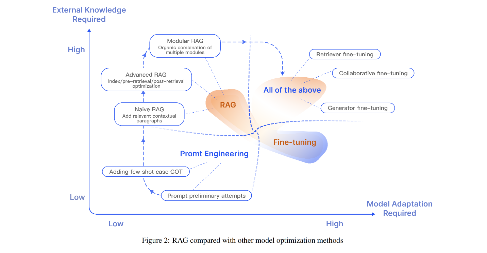

### Research Paper
* Retrieval-Augmented Generation for Large Language Models: A Survey

#### 算法妈妈研发技术决策
* 我们使用RAG技术
* 我们使用Prompt Engineering技术
* 我们不使用Fine Tune技术

#### Introduction
Large Language Models (LLMs) demonstrate significant capabilities but face challenges such as hallucination, outdated knowledge, and non-transparent, untraceable reasoning processes. Retrieval-Augmented Generation (RAG) has emerged as a promising solution by incorporating knowledge from external databases. This enhances the accuracy and credibility of the models, particularly for knowledge-intensive tasks, and allows for continuous knowledge updates and integration of domain-specific information. RAG synergistically merges LLMs' intrinsic knowledge with the vast, dynamic repositories of external databases. This comprehensive review paper offers a detailed examination of the progression of RAG paradigms, encompassing the Naive RAG, the Advanced RAG, and the Modular RAG. It meticulously scrutinizes the tripartite foundation of RAG frameworks, which includes the retrieval , the generation and the augmentation techniques. The paper highlights the state-of-the-art technologies embedded in each of these critical components, providing a profound understanding of the advancements in RAG systems. Furthermore, this paper introduces the metrics and benchmarks for assessing RAG models, along with the most up-to-date evaluation framework. In conclusion, the paper delineates prospective avenues for research, including the identification of challenges, the expansion of multi-modalities, and the progression of the RAG infrastructure and its ecosystem.

* Database seperation is the king.

#### ALGMON the paper
The paper titled "Retrieval-Augmented Generation for Large Language Models: A Survey" has been found on arXiv with the identifier [2312.10997]. You can access the paper directly via the following link: [arXiv:2312.10997](https://arxiv.org/abs/2312.10997).

This paper addresses the concept of Retrieval-Augmented Generation (RAG) in the context of Large Language Models (LLMs). RAG refers to the process of retrieving relevant information from external knowledge bases before LLMs generate responses or answers. This approach is particularly significant for addressing challenges in LLMs, such as hallucinations, slow knowledge updates, and lack of transparency in answers. The paper is likely to provide a comprehensive survey of the techniques and methods used in RAG, analyzing their effectiveness and applicability in various scenarios.

##### 1. What is the problem?
The primary issue being addressed is the limitations in Large Language Models (LLMs) regarding their reliance on static training data, leading to issues like outdated or inaccurate information, and a lack of transparency in their responses.

##### 2. Why is the problem important?
This problem is crucial because LLMs are increasingly used in various applications, and their effectiveness, reliability, and transparency directly impact their utility and trustworthiness.

##### 3. Why is the problem difficult?
The challenge lies in the static nature of training datasets for LLMs. Once trained, these models don't update their knowledge base, making it hard to provide current or context-specific information accurately.

##### 4. What are the old techniques?
Traditional methods involve training LLMs on large, static datasets, where the models generate responses based on the knowledge they acquired during training, without any external data references.

##### 5. Compared to the old ones, what are the pros and cons for this new proposed method?
The new method, Retrieval-Augmented Generation, overcomes these limitations by dynamically retrieving relevant information from external databases to enhance the responses. This approach improves accuracy, relevance, and up-to-date knowledge in LLM responses. However, it may introduce complexities in integrating external data sources and ensuring the reliability of the retrieved information.

* We go with Naive RAG first.

* We prefer RAG to fine-tuning

* We do Prompt Engineering, we do RAG but NOT Fine-Tuning