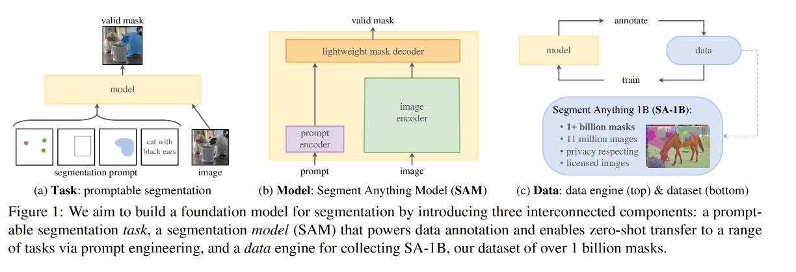
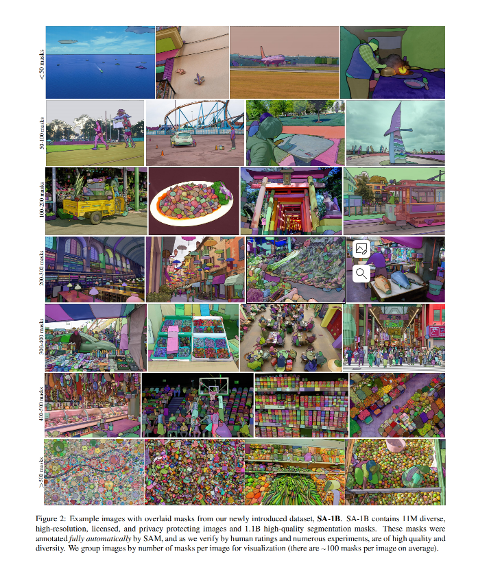

### Paper Title
* Segment Anything
* Meta AI

### Abstract
We introduce the Segment Anything (SA) project: a new task, model, and dataset for image segmentation. Using our efficient model in a data collection loop, we built the largest segmentation dataset to date (by far), with over 1 billion masks on 11M licensed and privacy respecting images. The model is designed and trained to be promptable, so it can transfer zero-shot to new image distributions and tasks. We evaluate its capabilities on numerous tasks and find that its zero-shot performance is impressive – often competitive with or even superior to prior fully supervised results. We are releasing the Segment Anything Model (SAM) and corresponding dataset (SA-1B) of 1B masks and 11M images at https://segment-anything.com to foster research into foundation models for computer vision.

### ALGMON the paper
The paper "Segment Anything" introduces the Segment Anything (SA) project, which encompasses a new task, model, and dataset for image segmentation. This project has led to the creation of the largest segmentation dataset to date, featuring over 1 billion masks on 11 million licensed and privacy-respecting images. The SA project aims to build a foundation model for image segmentation, leveraging a promptable segmentation task, a corresponding model (SAM), and a data engine for collecting the SA-1B dataset. This approach allows for zero-shot transfer to new image distributions and tasks through prompt engineering.

### Key Components of the Segment Anything Project:

1. **Task:** The project introduces a promptable segmentation task designed to return valid segmentation masks based on any given segmentation prompt. This task is used for both pre-training and solving general downstream segmentation tasks.

2. **Model:** The Segment Anything Model (SAM) is built to support flexible prompts, compute masks in real-time for interactive use, and handle ambiguity. SAM combines a powerful image encoder and a prompt encoder/mask decoder to predict segmentation masks effectively.

3. **Data Engine:** To train SAM on a diverse set of masks, the project developed a data engine, iterating between using the model for data annotation and improving the model with newly collected data. This engine includes assisted-manual, semi-automatic, and fully automatic stages for mask annotation.

4. **Dataset:** The SA-1B dataset comprises over 1 billion masks from 11 million images, collected using the data engine. This dataset aims to be a valuable resource for researching foundation models in computer vision.

5. **Responsible AI:** The project also addresses potential fairness concerns and biases in using the SA-1B dataset and SAM, aiming to ensure equitable real-world applications.

6. **Experiments:** SAM was extensively evaluated across various segmentation tasks, demonstrating high-quality mask production and strong performance in zero-shot transfer scenarios involving different object and image distributions.

7. **Accessibility:** The SA-1B dataset and SAM are made available for research under an open license, with an online demo showcasing SAM's capabilities.

This project represents a significant step forward in image segmentation, aiming to create a versatile and powerful foundation model capable of handling a wide range of segmentation tasks effectively.

To address the 5W methodology for the "Segment Anything" paper:

1. **What is the problem?** 
   The problem is the lack of a comprehensive and versatile model for image segmentation that can generalize to a wide variety of tasks and data distributions.

2. **Why is the problem important?**
   Efficient and accurate image segmentation is crucial for various applications in computer vision, including object recognition, scene understanding, and autonomous driving.

3. **Why is the problem difficult?**
   The difficulty lies in developing a model that can handle diverse segmentation tasks, interpret complex prompts, and generate high-quality masks in real-time.

4. **What are the old techniques?**
   Traditional segmentation models are typically designed for specific tasks or datasets and often require extensive training data, limiting their generalizability and adaptability.

5. **Compared to the old ones, what are the pros and cons for this new proposed method?**
   - **Pros:** SAM, the new model, enables zero-shot transfer to new tasks and datasets, is promptable for various segmentation tasks, and can generate masks rapidly for interactive use. It's trained on the extensive SA-1B dataset, enhancing its robustness and diversity.
   - **Cons:** While SAM shows promising results, there may be room for improvement in handling ambiguities and refining mask quality in certain complex scenarios.

### VIZ the paper

