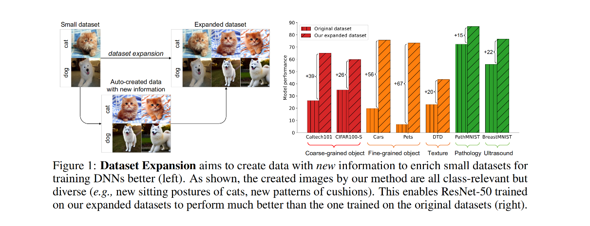

# 2023-12-06论文解读

## Paper Title
[Expanding Small-Scale Datasets with Guided Imagination](https://github.com/weijiang2023/algmon-kb/blob/main/kb/computer.science/DATASETS.2211.13976.pdf)

#### Authors
Yifan Zhang et. al.

#### Affiliations
National University of Singapore et. al.

#### Date
Oct 10, 2023

#### Abstract
The power of DNNs relies heavily on the quantity and quality of training data. However, collecting and annotating data on a large scale is often expensive and time consuming. To address this issue, we explore a new task, termed dataset expansion, aimed at expanding a ready-to-use small dataset by automatically creating new labeled samples. To this end, we present a Guided Imagination Framework (GIF) that leverages cutting-edge generative models like DALL-E2 and Stable Diffusion (SD) to "imagine" and create informative new data from the input seed data. Specifically, GIF conducts data imagination by optimizing the latent features of the seed data in the semantically meaningful space of the prior model, resulting in the creation of photo-realistic images with new content. To guide the imagination towards creating informative samples for model training, we introduce two key criteria, i.e., class-maintained information boosting and sample diversity promotion. These criteria are verified to be essential for effective dataset expansion: GIF-SD obtains 13.5% higher model accuracy on natural image datasets than unguided expansion with SD. With these essential criteria, GIF successfully expands small datasets in various scenarios, boosting model accuracy by 36.9% on average over six natural image datasets and by 13.5% on average over three medical datasets. The source code is available at https://github.com/Vanint/DatasetExpansion.

#### 5Ws
##### 1. What is the problem?
The problem addressed in the paper is the scarcity of data in training deep neural networks (DNNs). Specifically, the paper focuses on the task of dataset expansion, which aims to expand a small-scale dataset by automatically creating new labeled samples. This task is critical for enhancing both the quantity and quality of data available for DNN training.

##### 2. Why is the problem important?
The importance of the problem stems from the reliance of DNNs on large quantities of high-quality training data. Small-scale datasets often hinder the full realization of the potential of deep learning models. The manual collection and labeling of large-scale datasets are expensive and time-consuming, especially in small-scale scenarios. Therefore, finding a way to automatically expand datasets with informative and diverse samples is crucial for enhancing model training and performance, especially in fields like medical image understanding where data can be scarce.

##### 3. Why is the problem difficult?
The difficulty in dataset expansion lies in two main areas:

* Generating Samples with Correct Labels: Ensuring that the synthetic samples carry the correct labels and are beneficial to model training is challenging. This involves maintaining class semantics even after perturbation in the latent space.
* Informativeness and Diversity of Samples: It's not enough to just increase the number of samples. The new samples need to be informative (i.e., add new information relevant to the classes) and diverse (i.e., varied in content) to effectively boost model training.

##### 4. What are the old techniques?
Old techniques for dataset expansion primarily include data augmentation methods like applying pre-set transformations to images. However, these transformations alter the surface visual characteristics without creating fundamentally new content. This limits the new information introduced and leads to quick saturation in performance gains. Another old technique is the use of pre-trained generative models, but they usually don't guarantee the creation of samples with novel content and correct labels.

##### 5. Advantages and disadvantages of the new techniques?
Advantages:

* The Guided Imagination Framework (GIF) proposed in this paper leverages cutting-edge generative models and guides them to create informative new samples that maintain correct class labels and add diverse, novel content.
* GIF significantly outperforms traditional data augmentation methods and unguided generative models in terms of boosting the accuracy of DNNs trained on expanded datasets.
* GIF is more cost-effective and efficient than manual data collection and labeling.

Disadvantages:

* The paper notes that using only the generated samples for model training can be less effective than using real samples of equivalent size, indicating room for improvement in algorithmic data generation.
* The process might be computationally intensive compared to simpler augmentation techniques, especially for the iterative diffusion process used in parts of the framework.

##### 6. Conclusion

In conclusion, the paper presents a novel and effective approach to dataset expansion, addressing key challenges in data scarcity for DNN training. The Guided Imagination Framework significantly improves over old techniques by ensuring the creation of informative and diverse samples, which is crucial for enhancing the performance of deep learning models.