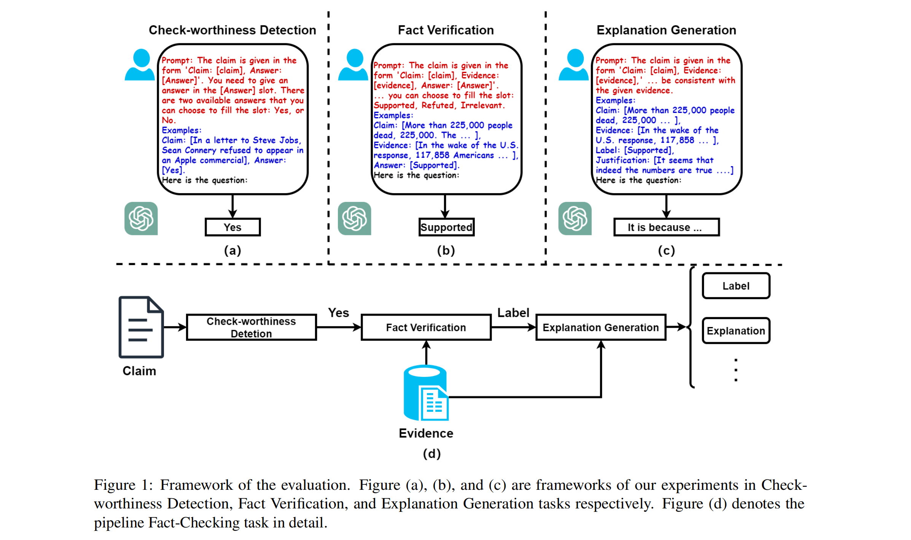

# 2023-11-30论文解读

## Paper Title
[Are Large Language Models Good Fact Checkers: A Preliminary Study](https://github.com/weijiang2023/algmon-kb/blob/main/kb/computer.science/FACT.2311.17355v1.pdf)

#### Authors
Han Cao et. al.

#### Affiliations
CAS et. al.

#### Date
Nov 29, 2023

#### 5Ws
The paper "Are Large Language Models Good Fact Checkers: A Preliminary Study" investigates the potential of Large Language Models (LLMs) in fact-checking. The study focuses on evaluating various LLMs in tackling specific fact-checking subtasks and conducts a comparative analysis of their performance against pre-trained and state-of-the-art low-parameter models.

##### 1. What is the problem?
The problem addressed in this paper is the evaluation of LLMs' capabilities in fact-checking. It seeks to determine how effectively these models can handle the different subtasks involved in fact-checking and compares their performance with other models.

##### 2. Why is the problem important?
Fact-checking is crucial in an era of information overload and misinformation. Assessing the veracity of claims with evidence is vital for maintaining the integrity of information. This study is important because it explores the potential of LLMs in this domain, which could lead to more efficient and scalable fact-checking processes.

##### 3. Why is the problem difficult?
The difficulty lies in the complexity of fact-checking, which involves various subtasks like check-worthiness detection, evidence retrieval, fact verification, and explanation generation. Each of these requires different capabilities from LLMs, such as understanding context, assessing credibility, and reasoning.

##### 4. What are the old techniques?
The paper discusses pre-trained models (like BERT, RoBERTa, and DeBERTa) and their limitations in fact-checking tasks, particularly their domain sensitivity and the requirement of large amounts of annotated data for training.

##### 5. Advantages and disadvantages of the new techniques?
LLMs like GPT-4 and LLaMa2 show promise in handling cross-domain tasks and can be fine-tuned for specific tasks with fewer examples. However, challenges include effectively handling non-English fact verification and avoiding hallucinations and language inconsistencies. The paper highlights that while LLMs demonstrate competitive performance in most scenarios, there is a need for further research to enhance their reliability as fact-checkers.

##### 6. Conclusion
In conclusion, the paper presents a detailed examination of the capabilities and limitations of LLMs in the context of fact-checking, indicating both their potential and the areas that require further development.